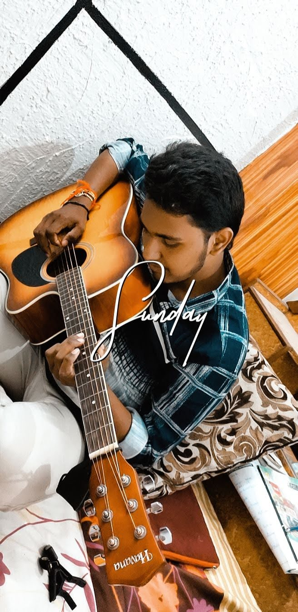

# Lalith Vuppala
I am from India,hyderabad. I'm a guitarist and love to sing,photography. I have completed my bachelor degree in the stream of Electronic & Communication Engineering.

*******
# Country Table

| Name of the country | Reason                        |Time to spent(DAYS)|
|---------------------|:--------------------------:|----------------:|
| America             | For Master's education                  |2 Years |
| Italy               |To have fun with friends                 |3 months |
| Switzerland |To get experice of the nature(mountains & hills) | 1 month |
| Combodia  | incredible amount of history and culture          | 2months |

******
# Quotes

> Don’t let yesterday take up too much of today. _Lalith_

> Whatever you are, be a good one.  _Lalith_

> Whatever might be the situation never loose you'r slef. _LalithNarayana Vuppala_